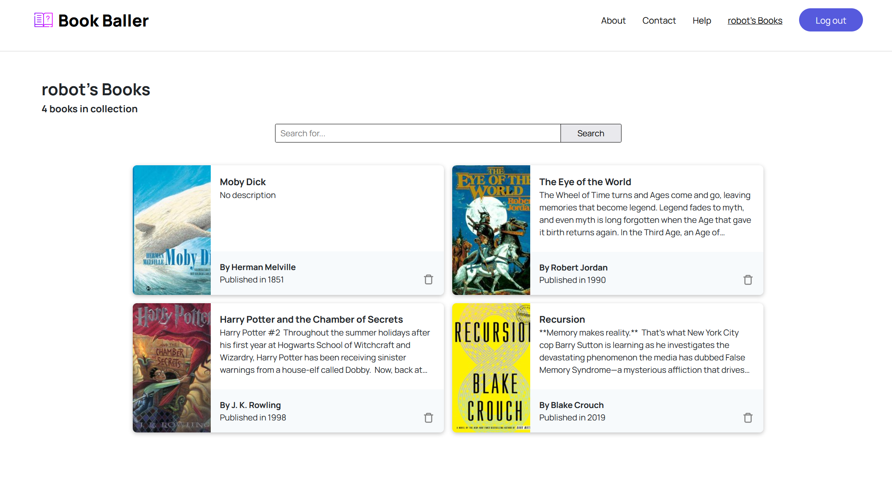

# Book Baller - A Simple Reading Tracker App

Book Baller is a simple yet powerful reading tracker web app that allows users to keep track of what they are reading.

## Project Goals

My goal with this project is to not only create a full-fledged app using the MERN stack but to also learn:
- Deployment and hosting
- Testing (unit testing, end-to-end testing, possibly integration testing)
- More in depth SASS usage

## Architecture and Some Design
Backend
- NodeJS
- Express
- MongoDB, Mongoose
- Most likely Auth0 with some JWTs thrown in

Frontend
- Vite
- React
- React Router
- SASS

The app will use an API to search for book data. Either the Google Books API or I'll take a closer look at the Open Library API to see if they have the data I'll need.

## Todo's

- [x] Backend: Initial server setup
- [x] Backend: Create routes
- [x] Backend: Start hashing out the backend api endpoints
- [ ] Database: Figure out how to run MondoDB locally so I won't have to use Atlas
- [x] Database: Design the schemas for the various collections
- [x] Frontend: Do some UI mockups and brainstorming 
- [x] Frontend: Style the book cards better + new footer
- [x] Frontend: Add loading indicators to things